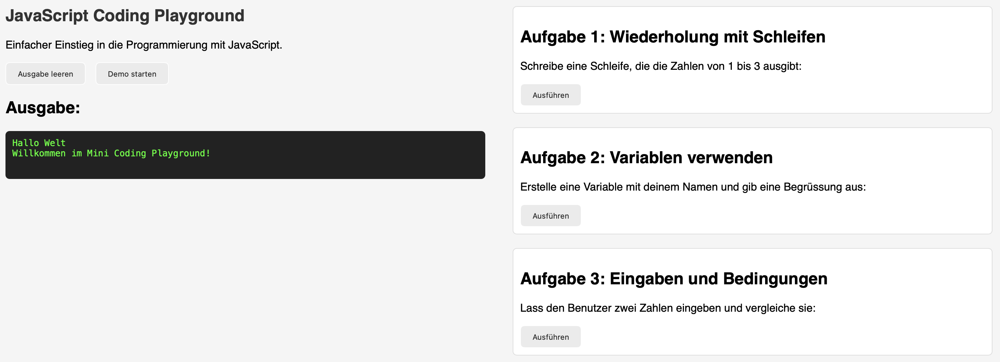
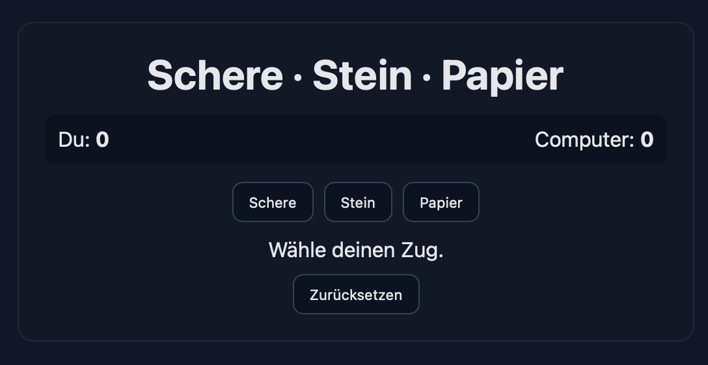

# 🧩 plain-js-setup

Ein kleines Starterprojekt für **Schnupperstift:innen in der Informatik**.  
Dieses Projekt bietet eine einfache Einführung in HTML, CSS und JavaScript – ganz ohne Frameworks oder komplizierte Setups.

---

## 🚀 Ziel des Projekts

Das Ziel ist es, erste Programmiererfahrungen zu sammeln und ein Verständnis für grundlegende Konzepte wie Variablen, Schleifen und Bedingungen zu entwickeln.  
Die Lernenden können im Browser direkt mit dem Code experimentieren und erste kleine Programme umsetzen.

---

## 🧰 Voraussetzungen

- Eine IDE wie **Visual Studio Code** (oder eine andere einfache Entwicklungsumgebung)  
- Kein zusätzliches Setup notwendig  
- Der Code läuft vollständig im Browser und basiert auf **reinem HTML, CSS und JavaScript**

---

## ▶️ Projekt ausführen

1. Projekt-Ordner öffnen  
2. Die Datei **`index.html`** im Browser öffnen  
   → Das Hauptprogramm startet automatisch  
3. Um Tests auszuführen, **`SpecRunner.html`** im Browser öffnen

---

## 🧪 Jasmine Tests

Das Projekt verwendet **Jasmine** für einfache JavaScript-Tests:  
👉 [https://jasmine.github.io](https://jasmine.github.io)

Im Ordner **`lib`** ist bereits eine lokale Kopie von Jasmine enthalten.  
Bei Bedarf kann diese aktualisiert werden:  
👉 [https://github.com/jasmine/jasmine/releases](https://github.com/jasmine/jasmine/releases)

> 💡 **TODO: Memo**  
> Falls sich herausstellt, dass die lokale Bibliothek nicht nötig ist,  
> den `lib`-Ordner entfernen, in `.gitignore` aufnehmen und stattdessen auf den offiziellen Download verweisen.

---

## 🧩 Projektstruktur

### 00_Sandbox  
Ein einfacher **Coding Playground** für erste kleine Aufgaben.  
Hier können Einsteiger:innen direkt Code ausprobieren – die Ausgabe erfolgt in der Browserkonsole oder direkt auf der Seite.

### 01_Schere_Stein_Papier  
Ein einfaches Web-Game-Grundgerüst.  
Einige Teile müssen noch implementiert werden.  
**Schwierigkeit:** leicht.  
Ein Testgerüst mit Jasmine ist bereits vorbereitet.

### 02_TicTacToe  
Aufbauend auf dem vorherigen Spiel – etwas komplexer, mit erweiterten Logik-Teilen.  
Hier wird das Verständnis von Bedingungen und Spiellogik vertieft.

### 03_Snake  
Das herausforderndste Projekt.  
Hier kommt eine **Game Loop** zum Einsatz.  
Es ist ein guter Einstieg in animierte Spieleentwicklung mit JavaScript.

---

## 📸 Screenshots

**Startansicht: Sandbox**  

**Beispiel-Aufgabe Schere Stein Papier:**  

---

## 🧭 Hinweise

- Der Code kann ohne Installation direkt im Browser ausgeführt werden.  
- Die **Theorieslides** bieten ergänzende Erklärungen zu den jeweiligen Themen.  